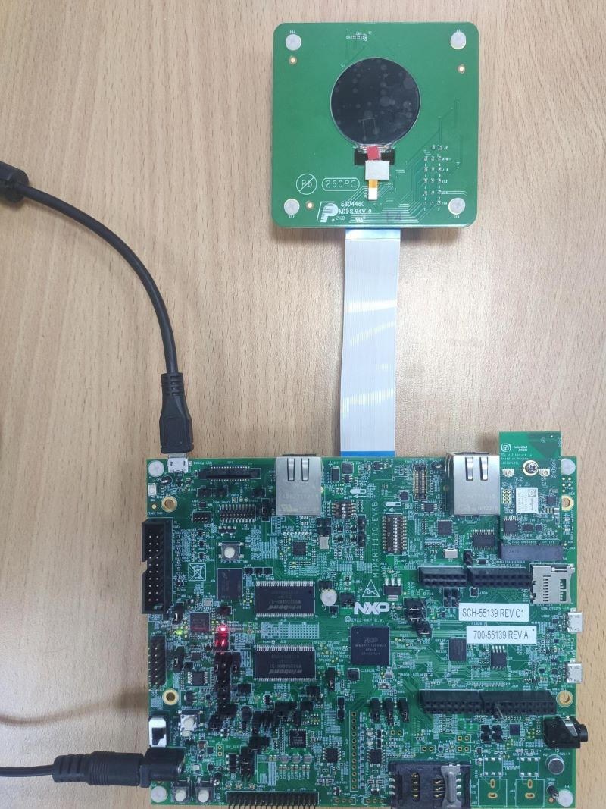
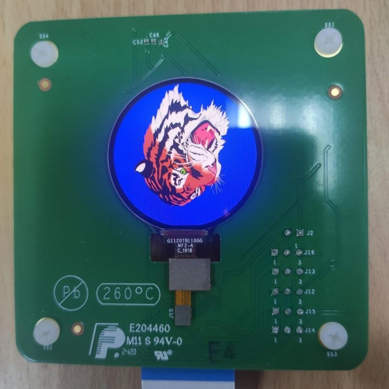

# NXP Application Code Hub
[](https://www.nxp.com)

## Dual-core driver for smart panel rm67162

This software displays a tiger on the smart LCD panel rm67162, in which the primary core uses VGLite to draw contents and the secondary core sends image data to the panel.

#### Boards: MIMXRT1170-EVK, MIMXRT1170-EVKB
#### Categories: Graphics
#### Peripherals: VIDEO
#### Toolchains: MCUXpresso IDE, IAR

## Table of Contents
1. [Software](#step1)
2. [Hardware](#step2)
3. [Setup](#step3)
4. [Results](#step4)
5. [Support](#step5)
6. [Release Notes](#step6)

## 1. Software<a name="step1"></a>
The software is delivered in raw source files and MCUXpresso/IAR IDE projects.

* MCUXpresso SDK 2.14.0
* MCUXpresso IDE, version is v11.8.0 or later
* IAR IDE, version is arm 9.40.1 or later
* MCUXpresso for Visual Studio Code: This example supports MCUXpresso for Visual Studio Code, for more information about how to use Visual Studio Code please refer [here](https://www.nxp.com/design/training/getting-started-with-mcuxpresso-for-visual-studio-code:TIP-GETTING-STARTED-WITH-MCUXPRESSO-FOR-VS-CODE).

There are two projects: cm7 & cm4. For IAR, the paths of .eww file are:

```
\cm7\source\iar\tiger_freertos_cm7.eww
\cm4\source\iar\mipi_dcs_cm4.eww
```

The primary core (cm7) is the start core, which achieves the initialization of MCMGR, VGLite and LCD panel, and activating the secondary core (cm4), etc. cm7 uses VGLite to draw tiger, prints FPS information through UART, and sends image data to cm4 through MCMGR. cm4 receives, processes, and sends image data to LCD panel finally.

The default frame buffer format in this project is RGB565, to use XRGB8888 format, set these macros in \cm7\board\display_support.h.
``` C
#define DEMO_RM67162_USE_RGB565 0
#define DEMO_RM67162_USE_XRGB8888 1
```

This project uses dual core by default, to use only the primary core (cm7), set this macro in display_support.h.
``` C
#define DEMO_RM67162_USE_DSI_AUX 0
```

## 2. Hardware<a name="step2"></a>
* MIMXRT1170-EVKB (need to rework: Solder 0 ohm resistor to **R414**)
* [G1120B0MIPI Display Panel](https://www.nxp.com/design/design-center/development-boards/i-mx-evaluation-and-development-boards/1-2-wearable-display-g1120b0mipi:G1120B0MIPI)
* Micro USB Cable
* Personal Computer




## 3. Setup<a name="step3"></a>
1. Connect a USB cable between the host PC and the OpenSDA USB port on the target board.
2. Open a serial terminal with the following settings:
    * 115200 baud rate
    * 8 data bits
    * No parity
    * One stop bit
    * No flow control
3. Open MCUXpresso/IAR IDE and import two projects.
4. Build cm4 project first, then build cm7 project.
5. Download the built images to the board through debug probe USB port and run two projects.

## 4. Results<a name="step4"></a>
The similar log below shows the output of this example in the terminal window:
```
60 frames in 2225 mSec: 26.966 FPS
60 frames in 2240 mSec: 26.785 FPS
60 frames in 2205 mSec: 27.210 FPS
```

When example is running, a tiger is rendered on the screen, which keeps rotating and scaling:



## 5. Support<a name="step5"></a>
If you have any questions or find a bug, please enter an issue in the issues tab of this GitHub repository.

#### Project Metadata
<!----- Boards ----->
[](https://github.com/search?q=org%3Anxp-appcodehub+MIMXRT1170-EVK+in%3Areadme&type=Repositories) [](https://github.com/search?q=org%3Anxp-appcodehub+MIMXRT1170-EVKB+in%3Areadme&type=Repositories)

<!----- Categories ----->
[](https://github.com/search?q=org%3Anxp-appcodehub+graphics+in%3Areadme&type=Repositories)

<!----- Peripherals ----->
[](https://github.com/search?q=org%3Anxp-appcodehub+video+in%3Areadme&type=Repositories)

<!----- Toolchains ----->
[](https://github.com/search?q=org%3Anxp-appcodehub+mcux+in%3Areadme&type=Repositories) [](https://github.com/search?q=org%3Anxp-appcodehub+iar+in%3Areadme&type=Repositories)

Questions regarding the content/correctness of this example can be entered as Issues within this GitHub repository.

>**Warning**: For more general technical questions regarding NXP Microcontrollers and the difference in expected funcionality, enter your questions on the [NXP Community Forum](https://community.nxp.com/)

[](https://www.youtube.com/@NXP_Semiconductors)
[](https://www.linkedin.com/company/nxp-semiconductors)
[](https://www.facebook.com/nxpsemi/)
[](https://twitter.com/NXP)

## 6. Release Notes<a name="step6"></a>
| Version | Description / Update                           | Date                        |
|:-------:|------------------------------------------------|----------------------------:|
| 1.0     | Initial release on Application Code Hub        | December 15<sup>th</sup> 2023 |


